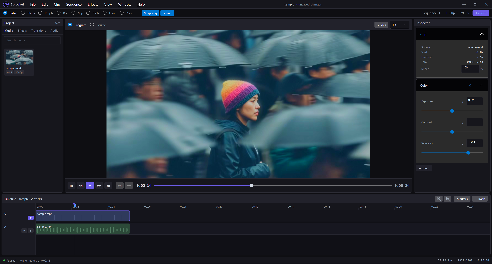

# Sprocket

**A cross-platform, non-destructive video editor — free and open source.**

<br clear="left" />

[](https://github.com/drittich/sprocket/actions/workflows/ci.yml)
[](https://github.com/drittich/sprocket/releases)
[](https://github.com/drittich/sprocket/releases)
[](#platform-support)
[](https://dotnet.microsoft.com)


Sprocket runs on Windows 11, Linux, and macOS from a single managed codebase. It pairs a pure-data
timeline model with GPU compositing (SkiaSharp) and library-level FFmpeg decode/encode, so C# acts
purely as an orchestrator while the pixel-heavy work happens on the GPU and in native code — decoded
frames never touch the managed heap per frame.



> **Project status — mid-build.** The end-to-end vertical slice is complete (import → trim → GPU
> effects → audio mixing → export → save/load), and the editor has grown into a full panelled NLE:
> multi-track timeline, editing tools, media bin, inspector, dual monitors, and undo/redo. What
> remains is proxy media, generators, transitions, plugins, and per-OS packaging — see the
> [Roadmap](#roadmap). The three guiding documents are authoritative: [BRIEF.md](BRIEF.md) (the
> *what*), [ARCHITECTURE.md](ARCHITECTURE.md) (the *how/why*), and [PLAN.md](PLAN.md) (the build
> order with per-step status).

---

## Features

### Working today

- **Non-destructive editing** — edits change a clip's in/out points, position, and effect stack;
  source media is never rewritten.
- **First-class undo/redo** — every model mutation routes through an inverse-command stack, with
  gesture coalescing (a slider drag is one undo step) and an edit-history surface.
- **Multiple video & audio tracks** — N video + N audio tracks, composited top-down with per-track
  opacity, blend mode, and mute/solo/enable.
- **Custom timeline** — ruler + playhead, clip filmstrips and audio waveforms, drag-move, edge-trim,
  snapping, and zoom. Editing tools: **Select**, **Blade** (razor split), **Slip**, plus **Hand**
  and **Zoom** view tools.
- **Linked A/V** — companion audio and video move and cut together.
- **GPU effects** — Brightness, Color (exposure / contrast / saturation), and a geometric
  **Transform** (scale / position / rotation / anchor / opacity), all as SkSL shaders that compose
  identically on preview and export. Video and audio **fades** driven by one envelope.
- **Keyframing** — animate any effect parameter with Hold/Linear interpolation and a per-parameter
  keyframe lane (add / move / delete keyframes).
- **Audio mixing** — sample-accurate mixer with per-clip gain envelopes, per-track gain, mute/solo,
  and a master gain + limiter. **Audio is the master clock** for A/V sync.
- **Hardware-accelerated decode** — D3D11VA / CUDA / QSV on Windows, VAAPI / CUDA on Linux,
  VideoToolbox on macOS, with automatic software fallback.
- **Media bin & browsers** — poster-frame thumbnails, waveforms, format/resolution badges, search,
  and an effects browser. Import via dialog or OS drag-and-drop.
- **Dual Source / Program monitors** — safe-area / framing-grid overlay, Fit/50/100/200% zoom, and
  full transport (jump-to-start/end, frame-step, play/pause).
- **Full-resolution export** — renders the timeline to H.264 / AAC MP4 through the *same* render
  graph that drives preview, at full source resolution.
- **Project save/load** — the timeline serializes to versioned JSON with relative + absolute media
  paths (a moved project relinks its media); offline media is tolerated.

### Planned

Proxy media (edit against low-res, export from originals) · title/text generators & adjustment
layers · alpha-channel compositing · transitions · export presets · a plugin system · advanced
color management (OpenColorIO / OFX) · DJI D-Log input color transforms. See the
[Roadmap](#roadmap).

---

## Platform support

| OS | Runtime IDs | Status |
|---|---|---|
| **Windows 11** | `win-x64`, `win-arm64` | Primary development platform; FFmpeg 8 natives bundled by the release script. |
| **Linux** | `linux-x64`, `linux-arm64` | Render path verified byte-identical to Windows (headless); release bundle verified end-to-end. |
| **macOS** | `osx-x64`, `osx-arm64` | Same managed code; release packaging is still in progress and published macOS assets are not attached to every release. |

The managed assemblies are identical on every OS — only the bundled native libraries differ per RID.
Sprocket bundles its **own FFmpeg 8** libraries rather than depending on a system install (distro
FFmpeg versions vary and are often ABI-incompatible). Sprocket talks to FFmpeg through its **own
hand-rolled P/Invoke binding** (no FFmpeg binding or runtime NuGet), so the natives for **every** RID —
Windows included — are fetched and bundled by the release script (see
[Creating a release](#creating-a-release)).

---

## Building from source

### Prerequisites

- **.NET 10 SDK**
- **`ffmpeg` CLI on `PATH`** — required only to run the media/audio *tests* (they generate a
  deterministic fixture clip once). Not needed to build or run the editor.

### Build, test, run

```bash
# Build the whole solution
dotnet build Sprocket.slnx

# Run all tests (xUnit)
dotnet test Sprocket.slnx

# Run one test project, or a single test by name
dotnet test tests/Sprocket.Core.Tests/Sprocket.Core.Tests.csproj
dotnet test tests/Sprocket.Core.Tests/Sprocket.Core.Tests.csproj --filter "FullyQualifiedName~TimingTests"

# Run the editor (optional first arg = a media file; otherwise a sample clip is generated)
dotnet run --project src/Sprocket.App [path/to/media.mp4]
```

### Cross-platform verification (Linux, headless)

The repo ships two Docker-based checks that need only Docker installed:

```bash
# Decode → SkSL shader → offscreen PNG, proving the media + Skia stack works on Linux
bash scripts/linux-check.sh

# Run a published linux-x64 release bundle on a clean machine and confirm the bundled
# FFmpeg libraries actually load (see "Creating a release" for the publish step first)
docker run --rm -v "$PWD:/repo" -e HOME=/root \
  mcr.microsoft.com/dotnet/runtime-deps:10.0 bash /repo/scripts/linux-smoke.sh
```

---

## Creating a release

[`scripts/release.ps1`](scripts/release.ps1) (PowerShell, cross-platform) publishes the editor as a
self-contained, single-file executable for each target runtime and bundles the matching FFmpeg 8
native libraries next to it.

```powershell
# Build + bundle the full RID matrix into ./dist
pwsh scripts/release.ps1

# Release from Windows for the currently supported published assets
pwsh scripts/gh-release.ps1 -Rids win-x64,win-arm64,linux-x64,linux-arm64

# A single runtime
pwsh scripts/release.ps1 -Rids win-x64

# Stamp a version into the artifact names
pwsh scripts/release.ps1 -Version 0.3.0
```

| Flag | Purpose |
|---|---|
| `-Rids <list>` | RIDs to build (default: `win-x64 win-arm64 linux-x64 linux-arm64 osx-x64 osx-arm64`). |
| `-Version <v>` | Version string stamped into the zip names (default `0.0.0-dev`). |
| `-Configuration` | Build configuration (default `Release`). |
| `-OutDir <dir>` | Output directory (default `dist`). |
| `-NoZip` | Leave the raw publish folders instead of zipping. |
| `-NoFFmpeg` | Publish only; skip FFmpeg native bundling. |
| `-NoReadyToRun` | Skip ReadyToRun AOT precompile — faster, smaller build; slower cold start. |
| `-OsxX64FFmpegUrl` / `-OsxArm64FFmpegUrl` | Archive URL of FFmpeg 8 macOS `.dylib`s to bundle. |

**How FFmpeg natives are sourced per RID:** Sprocket uses its own hand-rolled binding, so there is no
FFmpeg runtime NuGet for any platform — every RID's natives are fetched and bundled by this script.

- **win-x64 / win-arm64 / linux-x64 / linux-arm64** — downloaded from
  [BtbN FFmpeg-Builds](https://github.com/BtbN/FFmpeg-Builds) (`*-gpl-shared`, FFmpeg 8) and copied
  next to the executable.
- **osx-x64 / osx-arm64** — no canonical automated build exists; pass a `.tar.xz`/`.zip` URL via
  `-OsxX64FFmpegUrl` / `-OsxArm64FFmpegUrl` to bundle them, otherwise that bundle ships without
  FFmpeg and the script warns. On a macOS build host the script rewrites the dylibs' install names to
  `@loader_path` so the bundle is self-contained (no Homebrew, no `DYLD_*`).

When cutting GitHub releases from Windows, publish only `win-x64`, `win-arm64`, `linux-x64`, and
`linux-arm64` unless you have separately prepared bundled macOS FFmpeg dylibs.

### macOS local development / temporary manual setup

Some releases may omit macOS downloads entirely. When a release has no macOS download attached, or
when you are running from source locally on macOS, install FFmpeg 8 with Homebrew and point Sprocket
at its `lib` directory:

```bash
brew install ffmpeg@8
export SPROCKET_FFMPEG8_DIR="$(brew --prefix ffmpeg@8)/lib"
dotnet run --project src/Sprocket.App
```

For a published macOS archive that does not bundle FFmpeg yet, launch it from Terminal with the same
environment variable set:

```bash
brew install ffmpeg@8
export SPROCKET_FFMPEG8_DIR="$(brew --prefix ffmpeg@8)/lib"
chmod +x Sprocket
xattr -dr com.apple.quarantine .
./Sprocket
```

`SPROCKET_FFMPEG8_DIR` must point at the directory containing `libavcodec.62.dylib`,
`libavformat.62.dylib`, `libavutil.60.dylib`, `libswscale.9.dylib`, and `libswresample.6.dylib`.
This Homebrew-based setup is a temporary development/manual path, not the intended long-term
distribution story for macOS releases.

> **Verifying a release end-to-end.** The app sets no FFmpeg `RootPath`, so natives resolve from the
> application directory — and the bundled libraries depend on one another. Sprocket pre-loads them in
> dependency order at startup so a "drop the files beside the exe" bundle loads with no
> `LD_LIBRARY_PATH`. To prove a Linux bundle actually loads, publish it and run the smoke test:
>
> ```powershell
> pwsh scripts/release.ps1 -Rids linux-x64 -NoZip
> ```
> ```bash
> docker run --rm -v "$PWD:/repo" -e HOME=/root \
>   mcr.microsoft.com/dotnet/runtime-deps:10.0 bash /repo/scripts/linux-smoke.sh
> ```
>
> The app exposes a headless `--ffmpeg-check` flag that loads FFmpeg and exits; the smoke test runs
> it with `LD_LIBRARY_PATH` unset and expects `RESULT: PASS`.

---

## Architecture at a glance

Projects follow a strict, acyclic dependency direction. `Sprocket.Core` is the keystone and depends
on nothing — no UI, no native code.

```
Sprocket.App ──► Sprocket.Playback ──► Sprocket.Render ──► Sprocket.Core
     │              │      │              │
     │              │      └──► Sprocket.Audio ──► Sprocket.Core
     │              └──► Sprocket.Media ──────────► Sprocket.Core
     └──► (Persistence, Export) ──► Sprocket.Core
```

- **`Sprocket.Core`** — the pure-data timeline model (`Project → Timeline → Track[] → Clip`), the
  render graph (a pure function of project + time, so the same graph serves preview *and* export),
  the command stack, the tick-based time model, and the seam interfaces everyone else implements.
- **`Sprocket.Media`** — FFmpeg interop (decode, seek, resample, hardware decode, encode). Pixels
  stay in native buffers; no SkiaSharp or UI here.
- **`Sprocket.Audio`** — the mixer and the master clock (depends only on Core, not Media).
- **`Sprocket.Render`** — SkiaSharp GPU compositing and SkSL effect shaders.
- **`Sprocket.Playback`** — the clock-driven pump that keeps video in sync with the audio clock.
- **`Sprocket.Export`** — offline render-to-file over the same render graph.
- **`Sprocket.Persistence`** — versioned JSON save/load.
- **`Sprocket.App`** — the Avalonia UI shell and composition root.

Key design facts: time is `long` ticks at 240,000/sec (exact for 48 kHz audio and common + NTSC
frame rates — never `double` seconds); audio is the master clock; new features land on existing
seams rather than rewrites. See [ARCHITECTURE.md](ARCHITECTURE.md) for the full design (referenced
throughout the code as `§N`).

**Technology stack:** Avalonia UI 12 · SkiaSharp 3.119.4 (pinned to match Avalonia's transitive
Skia) · FFmpeg 8 via a hand-rolled `[LibraryImport]` binding · Silk.NET.OpenAL. All native interop is
P/Invoke against a C ABI — there is no C++/CLI — so one managed build serves all three OSes.

---

## Roadmap

The vertical slice (steps 1–9) and the post-slice editor build-out (steps 10–17) are complete.
Remaining work, in rough dependency order (full detail in [PLAN.md](PLAN.md)):

- **Proxy media** — generate and edit against low-res proxies; export from full-res originals.
- **Generators & adjustment layers** — title/text generator clips; effect stacks that apply to all
  tracks beneath them.
- **Alpha-channel compositing** — premultiplied-alpha path through the render graph.
- **Transitions** — transition library + overlapping-clip resolution.
- **Export presets & telemetry** — preset dropdown; GPU / hardware-accel / fps status in the status bar.
- **Plugins & advanced color** — collectible-`AssemblyLoadContext` plugin host; OpenColorIO / OFX.
- **Cross-platform native-lib bundling & packaging** — Windows installer, Linux AppImage/tarball,
  signed/notarized macOS `.app`; CI across win/linux/macOS runners.
- **Log media & color management** — DJI D-Log / D-Log M / D-Log 2 as per-clip input color
  transforms (GPU LUT), not a CPU round-trip.

---

## License

[MIT](LICENSE) © 2026 D'Arcy Rittich.

FFmpeg is bundled separately per platform. FFmpeg builds may be LGPL or GPL depending on the enabled
encoders (e.g. x264 → GPL); choose the build and license deliberately before distributing.
